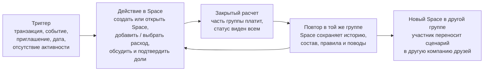
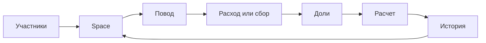

## Слайд 1. Executive Summary

Основа: `solution_structure_final.md` + текущая логика `2.x–7.1`.

Цель:
Сразу зафиксировать для C-level главную ставку, стартовый сегмент, продуктовую концепцию и логику проверки без прохождения через весь narrative.

Заголовок:
`Executive Summary`

Контент:

Акцентная строка:
`Главная ставка: начать с Salmon Spaces для общих расходов и расчетов внутри малых доверенных групп, где ценность растет по мере подключения других участников и повторных поводов.`

Блоки:

- `WHAT`
  - `Salmon Space` — приватное пространство группы, где связаны повод, расход / сбор / цель, доли, обсуждение, расчет и история.

- `WHY`
  - `Боль охватная и регулярная` — друзья уже делят общие расходы и закрывают их вручную; это лучшая точка входа по сочетанию боли, частоты поводов и переноса сценария в другие графы.
  - `Это Network Effect` — локальный прямой эффект: добавленный новый участник позволяет другим участникам Space решить задачу; повторные контексты углубляют ценность в том же Space, а создание новых групп расширяет сеть.
  - `Бизнес эффект` — `TAM / SAM / SOM` и `Bottom Up`.

- `HOW`
  - Проверяем боль и то, насколько качественно и удобно Space закрывает задачу.
  - Проверяем привлечение новых активированных пользователей Salmon и закрепляется ли привычка.
  - Проверяем перенос в новые графы и банковую экономику.

Переход к основной истории:
`Дальше — почему именно такой тип network effect, почему стартуем с друзей и как устроен сам Salmon Space.`

Источники:

- [solution_structure_final.md](/Users/roman/Documents/Pet Projects/Salmon test task/solution_structure_final.md)
- [slides_draft.md](/Users/roman/Documents/Pet Projects/Salmon test task/slides_draft.md)

Указания для верстки:

- Основная композиция: `1` акцентная строка сверху и ниже `3` компактных блока `WHAT / WHY / HOW`.
- Это не agenda slide: на слайде должен быть уже ответ, а не план рассказа.
- `WHY` должен состоять из `3` аргументов: боль, network effect, бизнес эффект.
- При верстке добавить гиперссылки из `WHY` на подробные слайды: боль -> сегментный блок, network effect -> `4.3`, бизнес эффект -> блок с `TAM / SAM / SOM` и `Bottom Up`, когда он появится.
- `HOW` сделать визуально ближе к decision framework, а не к длинному roadmap.

---

## Слайд 2.1. Что делает продукт сетевым

Основа: `solution_structure_final.md` + `llm_data/ordinary_llm_answers.md` + `llm_data/perplexity_data.md`.

Цель:
Зафиксировать для C-level жесткий фильтр: network effect - это механизм роста ценности, а не роста дистрибуции.

Заголовок:
`Что делает продукт сетевым`

Подзаголовок:
`Network effect ≠ виральность ≠ масштаб ≠ привычка.`

Контент:

Definition block:

`Network effect (NE) отвечает на вопрос: растет ли ценность продукта для пользователя из-за активности, наличия или вклада других пользователей?`

Два типа эффекта:

- `Прямой эффект`: другие участники нужны, чтобы задача работала или решалась лучше. Примеры: P2P-перевод, разделение счета, общая цель.
- `Непрямой эффект`: одни участники создают контекст или предложение, которое становится ценностью для других. Примеры: продавцы → покупатели, водители → пассажиры, создатели → аудитория.

Тест на NE:

- `Если убрать часть пользователей, продукт становится слабее.`
- `Если рост держится только на маркетинге, это не NE.`

Источники:

- [NFX, The Network Effects Manual](https://www.nfx.com/post/network-effects-manual/) - ссылка уже есть в `llm_data/ordinary_llm_answers.md` (`[R2]`) и в `llm_data/perplexity_data.md`.
- [Andrew Chen, The Cold Start Problem](https://andrewchen.com/chapter-one-cold-start/) - ссылка уже есть в `llm_data/ordinary_llm_answers.md` (`[R3]`) и в `llm_data/perplexity_data.md`.
- [Rochet & Tirole, Platform Competition in Two-Sided Markets](https://academic.oup.com/jeea/article/1/4/990/2280902) - ссылка уже есть в `llm_data/ordinary_llm_answers.md` (`[R1]`) и в `llm_data/perplexity_data.md`.

Визуал:

- сверху короткий подзаголовок-рамка `Network effect ≠ виральность ≠ масштаб ≠ привычка`;
- ниже один definition block с ключевой формулировкой;
- затем 2 равновесные карточки: `Прямой эффект` и `Непрямой эффект`;
- ниже компактный блок `Тест на NE` на 2 пункта;
- внизу мелкий source row с 3 гиперссылками;
- takeaway на этом слайде не нужен.

Указания для верстки:

- Слайд должен читатьcя как board-level filter, а не как учебник по теории.
- Definition block - главный смысловой якорь после заголовка.
- В карточках сначала короткая формула, потом одна строка с примерами.
- Источники визуально вторичны, но обязаны быть кликабельными в `pptx`.
- Не использовать таблицу `NE / Not NE`; различие с виральностью и маркетингом уже зафиксировано в подзаголовке и тесте.

---

## Слайд 2.2. Лучшие кейсы и практические принципы

Основа: `solution_structure_final.md` + `llm_data/perplexity_data.md` + `llm_data/ordinary_llm_answers.md`.

Цель:
Показать C-level, какие механики network effects реально создают рост и защищенность, а какие дают только утилитарную пользу без настоящего сетевого преимущества.

Заголовок:
`Какие NE-механики реально работают`

Контент:

Кейсы:

- `Venmo`
  - `Платеж -> заметка -> видимость друзьям` превратил перевод денег в социальный слой.
  - Реальный NE живет не в ленте как таковой, а в плотности нужных контактов внутри сети.
  - `65% пользователей используют приложение еженедельно; в среднем 8,5 транзакции в месяц.`

- `M-Pesa`
  - `Перевод по номеру телефона -> выдача наличных у локального агента`.
  - Больше пользователей повышают жизнеспособность агентской сети; больше агентов повышают полезность сервиса для новых пользователей.
  - `К концу 2009 года: 65% домохозяйств, 4 тыс. -> 23 тыс. агентских точек; ~194 тыс. домохозяйств выведены из бедности.`

- `WeChat Red Envelopes`
  - WeChat не изобрел новый сценарий, а оцифровал существующий ритуал дарения денег.
  - Онбординг в платежи был встроен в праздничный социальный момент: чтобы участвовать, нужно привязать карту.
  - `1 млрд цифровых конвертов за новогоднюю ночь 2015; 100-200 млн привязок банковских карт в ходе кампании.`

- `Strava`
  - Видимость активности друзей + легкая социальная реакция (`kudos`) усиливают вовлечение без тяжелого UGC.
  - Это не финтех, но важный переносимый принцип для групповых денег: социальная реакция должна быть дешевой и уместной.
  - `Активности в группах 10+ человек на 40% длиннее; беговые клубы +59% г/г; эффект kudos подтвержден академически.`

Практические принципы:

1. `Сначала атомарная сеть.` Ценность должна возникать уже внутри небольшой доверенной группы.
2. `NE-петля должна включать нового пользователя.` NE начинается там, где подключение нового участника повышает ценность сценария для уже активного.
3. `Опираемся на уже существующую группу (граф) или контекст.`
4. `Видимость и социальная реакция усиливают уже ценный сценарий.`

Источники:

- [Andrew Chen, The Cold Start Problem](https://andrewchen.com/wp-content/uploads/2022/01/ColdStartProb_9780062969743_AS0928_cc20_Final.pdf)
- [NFX, The Network Effects Manual](https://www.nfx.com/post/network-effects-manual)
- [Backstrom et al., Group Formation in Large Social Networks](https://snap.stanford.edu/class/cs224w-readings/backstrom06groupformation.pdf)
- [Zhang & Marbach, "Two is a Crowd"](https://www.cs.toronto.edu/~marbach/PUBL/gamenets_11.pdf)
- [Ugander et al., Structural Diversity in Social Contagion](https://pmc.ncbi.nlm.nih.gov/articles/PMC3341012/)
- [Lerman et al., The Majority Illusion in Social Networks](https://journals.plos.org/plosone/article?id=10.1371%2Fjournal.pone.0147617)
- [a16z, The Dynamics of Network Effects](https://a16z.com/the-dynamics-of-network-effects/)
- [UMBC/CHI, The Curious Case of Social Awareness Streams](https://courses.cs.umbc.edu/graduate/CMSC691/spring22/pdf/3134663.pdf)
- [CoinLaw, Zelle vs Venmo statistics](https://coinlaw.io/zelle-vs-venmo-statistics/)
- [NBER, Mobile Money: The Economics of M-PESA](https://www.nber.org/system/files/working_papers/w16721/w16721.pdf)
- [Georgetown / Science 2016 summary on M-Pesa poverty impact](https://www.georgetown.edu/news/study-use-of-mobile-money-lifts-nearly-200000-kenyans-out-of-poverty/)
- [Wikipedia, WeChat red envelope](https://en.wikipedia.org/wiki/WeChat_red_envelope)
- [Reuters, WeChat users send 46 billion digital red packets over Lunar New Year](https://www.reuters.com/article/technology/corrected-wechat-users-send-46-billion-digital-red-packets-over-lunar-new-year-idUSKBN15J0BH/)
- [Strava Year in Sport Trend Report 2024](https://assets.ctfassets.net/wad4jonn1ykp/1sJg4OiBKFoGYDtw9NV9v4/8c39f8a577db84a32cec43055938124c/Strava_Year_in_Sport_-_The_Trend_Report_-_en-US.pdf)
- [Franken et al., Kudos make you run! (2023)](https://research.rug.nl/en/publications/kudos-make-you-run-how-runners-influence-each-other-on-the-online/)

Указания для верстки:

- Основная композиция: `4 карточки кейсов` сверху или слева; `4 принципа` отдельным компактным списком справа или снизу.
- На карточках оставить только: `ключевое взаимодействие`, `механизм NE`, `1 метрику`.
- Источники вынести в нижнюю строку мелким кеглем; все ссылки должны остаться кликабельными.
- Не добавлять таблицу `marketing vs NE` на этот слайд: она дублирует логику 2.1 и перегружает страницу.

---

## Слайд 2.3. Сильный NE не гарантирует успех

Основа: `test_task.md` + `solution_structure_final.md` + `llm_data/perplexity_data.md` + `llm_data/ordinary_llm_answers.md` + `llm_data/WeChat.md`.

Цель:
Ответить на вопросы `3` и частично `4` из задания: даже сильный network effect не взлетает сам по себе. Побеждают кейсы, где совпали архитектура продукта, момент рынка и встроенная дистрибуция.

Заголовок:
`Сильный NE не гарантирует успех`

Подзаголовок:
`Побеждают не просто "вирусные" продукты, а те, где механизм роста совпал с моментом рынка и каналом дистрибуции.`

Контент:

Кейсы:

- `WeChat Red Envelopes`
  - `Что это:` цифровой слой на существующем ритуале дарения денег внутри WeChat.
  - `Рост:` готовый социальный граф + культурный ритуал + дистрибуция через крупнейший мессенджер страны.
  - `Вердикт:` сильный NE сработал потому, что совпали граф, момент и канал.

- `M-Pesa`
  - `Что это:` мобильные деньги с переводом по номеру телефона и выдачей наличных у локального агента.
  - `Рост:` национальный инфраструктурный gap + Safaricom + агентская сеть.
  - `Вердикт:` успех дал не “лучший UX”, а реальная рыночная дыра.

- `Venmo`
  - `Что это:` P2P-платежи с публичностью переводов через заметки и ленту друзей.
  - `Рост:` повторяемый split-сценарий + social visibility + плотный ближний граф.
  - `Вердикт:` лента ускоряла дистрибуцию, но защита была в плотности нужных контактов.

- `Honeydue / Zeta`
  - `Что это:` продукты для совместных финансов внутри пары или домохозяйства.
  - `Рост не сложился:` боль была реальной, но сегмент узкий, а слой счета и доверия уже принадлежал банкам.
  - `Вердикт:` valid use case не равен сильному winner.

`Маркетинг vs NE`
`Рост покупается, когда продукту нужен внешний push, чтобы собрать критическую массу.`
`Рост сам себя усиливает, когда новый участник повышает ценность сценария для уже активных пользователей.`

Что это значит для нашего кейса:
`Для Salmon нужен не просто social money сценарий, а продукт, где второй участник нужен по логике самого использования.`

Источники:

- [Andrew Chen, The Cold Start Problem](https://andrewchen.com/wp-content/uploads/2022/01/ColdStartProb_9780062969743_AS0928_cc20_Final.pdf)
- [Wikipedia, WeChat red envelope](https://en.wikipedia.org/wiki/WeChat_red_envelope)
- [Northwestern Medill, How WeChat redefined rituals in a digital age](https://spiegel.medill.northwestern.edu/wp-content/uploads/sites/2/2021/04/How-WeChat-redefined-rituals-in-a-digital-multiplatform-age-The-Medill-IMC-Spiegel-Research-Center.pdf)
- [NBER, Mobile Money: The Economics of M-PESA](https://www.nber.org/system/files/working_papers/w16721/w16721.pdf)
- [GSMA, The Adoption and Impact of M-Pesa](https://www.gsma.com/solutions-and-impact/connectivity-for-good/mobile-for-development/country/kenya/the-adoption-and-impact-of-m-pesa-a-first-look-at-some-new-data/)
- [UMBC/CHI, The Curious Case of Social Awareness Streams](https://courses.cs.umbc.edu/graduate/CMSC691/spring22/pdf/3134663.pdf)
- [CoinLaw, Zelle vs Venmo statistics](https://coinlaw.io/zelle-vs-venmo-statistics/)
- [Zeta official shutdown statement](https://www.askzeta.com)
- [Startups.RIP, Honeydue](https://startups.rip/company/honeydue)
- [Y Combinator, Honeydue](https://www.ycombinator.com/companies/honeydue)

Указания для верстки:

- Ниже заголовка сразу `4 кейс-карточки` в сетке `2x2`; в каждой карточке оставить `что это`, `рост`, `вердикт`.
- Метрики не выносить в карточки; смысл слайда в сравнении причин успеха, а не в объеме цифр.
- Под карточками отдельный короткий блок `Маркетинг vs NE`, затем `1` takeaway line и source row.
- Слайд должен отвечать на вопрос `можно ли было не взлететь с тем же продуктом?` без ощущения теоретического эссе.

---

## Слайд 2.4. NE в финтехе

Основа: `solution_structure_final.md` + `llm_data/perplexity_data.md` + `llm_data/ordinary_llm_answers.md` + `llm_data/Revolut.md`.

Цель:
Показать, что в финансах важно различать `накопительный NE`, `ограниченный NE` и `NE на уровне функции`, где функция использует уже существующую сеть, но не создает новую самостоятельную защиту.

Заголовок:
`NE в финтехе`

Подзаголовок:
`Важно различать эффект, который накапливается на уровне всей сети, остается внутри группы или живет только на уровне фичи.`

Контент:

`Накопительный NE`

- `Zelle + Pix`
  - Встроенная в банки и национальная инфраструктура мгновенных переводов.
  - Каждый новый участник делает сеть полезнее для всей системы.
  - `Метрика:` `Zelle: $1 трлн и 151 млн аккаунтов в 2024; Pix: 165 млн пользователей и 46% всех электронных платежей в Бразилии.`

- `WeChat Pay`
  - Платежный слой внутри доминирующего социального графа.
  - Ценность накапливается по мере роста сети контактов, чатов и ритуалов внутри super-app.
  - `Метрика:` `WeChat Pay + Alipay контролируют 93-94% мобильных платежей Китая.`

- `M-Pesa`
  - Mobile money + агентская сеть.
  - Больше пользователей поддерживают больше агентов; больше агентов делают сеть полезнее для новых пользователей.
  - `Метрика:` `4 тыс. -> 23 тыс. агентских точек; 65% домохозяйств к концу 2009 года.`

`Ограниченный NE`

- `Revolut Joint Accounts`
  - Совместный счет для двух пользователей Revolut.
  - Ценность резко растет внутри пары или домохозяйства, но почти не переносится между группами.
  - `Вердикт:` сильный парный эффект, но слабое накопление на уровне всей сети.

- `Splitwise`
  - Приложение для учета долгов и разделения расходов.
  - Каждый новый участник помогает внутри конкретной группы, но рост всей сети слабо усиливает ценность для уже существующих групп.
  - `Вердикт:` групповой эффект есть, но он ограничен границами сценария.

`NE на уровне функции`

- `Split / request-to-pay inside banking apps`
  - Встроенные сценарии разделения счета, урегулирования и оплаты со счета.
  - Фича использует сетевой эффект базовой платежной сети, но сама не создает отдельную сеть ценности.
  - `Вердикт:` ценность в основном задает базовая платежная сеть, а не сама функция разделения счета.

Что это значит для нашего кейса:
`Наше окно - не платежные сети и не совместный счет, а сценарий, где ограниченный групповой эффект можно повторять между многими доверенными группами и со временем превращать в накопительный.`

Источники:

- [Zelle press release: $1T in 2024](https://www.zelle.com/press-releases/zelle-shatters-records-1-trillion-sent-single-year)
- [CNBC: 151M users and Zelle growth](https://www.cnbc.com/2025/02/12/zelle-payments-top-1-trillion-in-2024.html)
- [Faster Payments Council: Pix by the Numbers Q1 2025](https://fasterpaymentscouncil.org/userfiles/2080/files/Pix%20by%20the%20Numbers%20Q1%202025.pdf)
- [Salmon website content synthesis](llm_data/salmon_website_content.md)
- [Yahoo Finance: Pix share of electronic payments in Brazil](https://finance.yahoo.com/news/brazil-embedded-finance-databook-report-080500418.html)
- [CGAP: China Digital Payments Revolution](https://www.cgap.org/research/publication/china-digital-payments-revolution)
- [BIS Paper 117: DNA feedback loop and fintech concentration](https://www.bis.org/publ/bppdf/bispap117.pdf)
- [NBER: Mobile Money - The Economics of M-PESA](https://www.nber.org/system/files/working_papers/w16721/w16721.pdf)
- [Georgetown / Science 2016 summary on M-Pesa poverty impact](https://www.georgetown.edu/news/study-use-of-mobile-money-lifts-nearly-200000-kenyans-out-of-poverty/)
- [Revolut Annual Report 2024](https://www.revolut.com/en-US/annual-report/2024/)
- [Revolut Help: Joint Accounts](https://help.revolut.com/en-MT/help/profile-and-plan/joint-accounts/how-to-set-up-a-joint-account-with-revolut/)
- [Tink x Splitwise Pay by Bank](https://tink.com/press/splitwise-tink-partner/)

Указания для верстки:

- Основная композиция: `3 смысловых блока` — `накопительный NE`, `ограниченный NE`, `NE на уровне функции`.
- В каждом блоке использовать `1-3 компактные карточки`; внутри карточки не дублировать лейблы `что это / почему`, а оставлять только 2 короткие строки смысла и `verdict`.
- Не добавлять нижнюю плашку с ограничениями: этот слайд должен быть легче и быстрее читаться, чем предыдущая версия.
- Цветовой код: `накопительный NE` — зеленый, `ограниченный NE` — янтарный, `NE на уровне функции` — серо-синий.
- Источники оставить в нижней строке мелким кеглем; все ссылки должны быть кликабельными.

---

## Слайд 2.5. Выберем направление (bet)

Основа: `test_task.md` + `solution_structure_final.md` + `vision_ideas.md` + `llm_data/perplexity_data.md` + `llm_data/known_cases.md` + `llm_data/salmon_website_content.md`.

Цель:
Сузить пространство гипотез до `4` стратегических направлений, связать их с типами сетевых эффектов и показать, где находится мой стартовый bet до выбора конкретного сегмента.

Заголовок:
`Выберем направление (bet)`

Контент:

Подзаголовок:
`Полный список гипотез: [Google Sheets](https://docs.google.com/spreadsheets/d/1jzzUfvo3hHp4h_i9hOXBEJrKNEJ5Zv2G/edit?usp=sharing&ouid=108348471121640094070&rtpof=true&sd=true)`

Блоки:

1. `Move`
`Переводы и расчеты между людьми.`
Гипотезы:
`P2P-переводы внутри сети Salmon, split расходов, денежный мессенджер, чаевые и пожертвования по QR.`
NE-категория:
`Прямой эффект; ближе всего к Personal Utility. В отдельных сценариях — Market Networks и Marketplace (2-Sided).`

2. `Store`
`Совместное хранение денег и прав доступа.`
Гипотезы:
`Семейные продукты, совместное управление деньгами, общие балансы и роли.`
NE-категория:
`Прямой эффект; Personal Utility. В более сложной форме — Market Networks внутри семьи или домохозяйства.`

3. `Spend & Credit`
`Траты, торговые сценарии и кредитные механики.`
Гипотезы:
`MCP marketplace, совместное погашение, collaborative BNPL, депозиты с поручителями, совместная ипотека, P2P-кредитование.`
NE-категория:
`В основном непрямой эффект; Marketplace (2-Sided). Для кредитных пулов местами появляется Asymptotic Marketplace.`

4. `Earn & Grow`
`Совместное накопление, инвестиции и сбор средств.`
Гипотезы:
`Совместные инвестиции, фандрайзинг, контент вокруг финансовой грамотности и инвестиций.`
NE-категория:
`Чаще всего Market Networks и Marketplace (2-Sided). Для контента — Hub-and-Spoke, но это не ядро нашей ставки.`

Комментарий по NFX:
`Проверка через NFX: Move и Store ближе всего к direct / Personal Utility; Spend & Credit — к indirect / Marketplace (2-Sided); Earn & Grow — к Market Networks и Marketplace. Protocol, Physical, Platform и чистый Hub-and-Spoke не являются нашим стартовым ядром.`

Источники:

- [Salmon-test-task.xlsx - directions.tsv](/Users/roman/Documents/Pet Projects/Salmon test task/Salmon-test-task.xlsx - directions.tsv)
- [theory_nfx.md](/Users/roman/Documents/Pet Projects/Salmon test task/theory_nfx.md)
- [llm_data/salmon_website_content.md](/Users/roman/Documents/Pet Projects/Salmon test task/llm_data/salmon_website_content.md)

Указания для верстки:

- Основная композиция: `4 карточки` на одном экране и `1` комментарий по NFX внизу.
- Номер слайда и служебные плашки не нужны.
- Гипотезы внутри карточек держать короткими; не пытаться уместить полный список.
- Источники лучше подать как короткий ряд гиперссылок внизу.

---

## Слайд 3.1. Сравнение 4 стартовых сегментов

Основа: `Salmon-test-task.xlsx - segments (1).tsv` + `test_task.md` + `solution_structure_final.md`.

Цель:
Сравнить `4` сегмента и выбрать один стартовый. К масштабу и частоте добавить `переносимость графа`.

Заголовок:
`Какой сегмент берем первым`

Подзаголовок:
`Расчеты: [локальная таблица](/Users/roman/Documents/Pet Projects/Salmon test task/Salmon-test-task.xlsx - segments (1).tsv) / [Google Sheets](https://docs.google.com/spreadsheets/d/1jzzUfvo3hHp4h_i9hOXBEJrKNEJ5Zv2G/edit?gid=1447909165#gid=1447909165&range=N1)`

Контент:

Критерий отбора:
`Сначала смотрим на reach × frequency, затем — насколько один пользователь естественно приносит продукт в другие графы.`

Карточки:

1. `Друзья`
`Лучший стартовый сегмент.`
Почему:
`Граф уже живет в ежедневных чатах и переносится между ужинами, поездками, подарками и событиями. Это лучший сегмент по сетевому распространению.`
Потребность / что сейчас:
`Нужно быстро и без неловкости закрыть общий расход; сейчас — чат, перевод и ручная сверка.`
Аргументы:
Филиппины занимают 1-е место в мире по времени в соцсетях: `3 ч 32 мин` в день; `67,1%` используют соцсети для связи с друзьями.

2. `Пары / партнеры`
`Сильный сегмент второго этапа.`
Почему:
`Частота и размер высокие, но граф почти всегда замкнут внутри двух человек. Сценарий силен по использованию, но слабее по переносу.`
Потребность / что сейчас:
`Нужно делить регулярные траты и сохранять автономию; сейчас — раздельные счета, ручные переводы и иногда joint account.`
Аргументы:
`26,39 млн` пар; `62%` пар держат хотя бы часть денег раздельно; финансовые взаимодействия происходят несколько раз в неделю или чаще.

3. `Дети в семьях`
`Сильный сегмент второго этапа.`
Почему:
`Частота максимальная: ежедневные траты, школьные платежи, переводы и контроль. Но сценарий живет внутри household и хуже переносится наружу.`
Потребность / что сейчас:
`Нужно давать деньги, контролировать траты и сборы; сейчас — наличные, перевод с кошелька родителя и ручной контроль.`
Аргументы:
Около `17,95 млн` семей с детьми; семейные платежи происходят ежедневно; около `35` цифровых транзакций в месяц на пользователя.

4. `Небольшие группы коллег`
`Сильный запасной вариант.`
Почему:
`Граф переносимее, чем у семейных сегментов: у людей несколько рабочих и полурабочих кругов. Но контекст чувствительнее и эмоциональная мотивация слабее, чем у друзей.`
Потребность / что сейчас:
`Нужно собирать и возвращать деньги за обеды, подарки и офисные мелочи; сейчас — чат, payroll отдельно и ручные P2P.`
Аргументы:
`31,6 млн` наемных работников; рабочие группы общаются `5` дней в неделю; групповые чаты — рабочая норма.

Вывод:
`Стартуем с друзей вокруг поездок, ужинов и событий. Пары / партнеры и дети в семьях — следующий слой, небольшие группы коллег — запасной вариант.` 

Источники:

- [Salmon-test-task.xlsx - segments (1).tsv](/Users/roman/Documents/Pet Projects/Salmon test task/Salmon-test-task.xlsx - segments (1).tsv)
- [PSA: Family Size and Family Head Characteristics](https://rsso01.psa.gov.ph/system/files/attachment-dir/Special%2520Release%2520No.%25202022-045_Family%2520Size%2520and%2520Family%2520Head%2520Characteristics.pdf)
- [Bankrate couples finances survey](https://www.bankrate.com/f/102997/x/62268aa83c/couples-finances-press-release-2026.pdf)
- [Meltwater Philippines social media statistics](https://www.meltwater.com/en/blog/social-media-statistics-philippines)
- [BSP 2024 Report on E-payments Measurement](https://www.bsp.gov.ph/PaymentAndSettlement/2024_Report_on_E-payments_Measurement.pdf)
- [CPBRD: PH Employment Situation 2024](https://cpbrd.congress.gov.ph/wp-content/uploads/2025/02/FF2024-63-PH-Employment-Situation-2024.pdf)

Примечание:

`Кроме этого списка из 4 сегментов, мы также рассмотрели зависимых членов расширенной семьи, международные семьи / переводы, микробизнес и соседей по жилью. Полные расчеты вынесены в таблицу по ссылке выше.`

Указания для верстки:

- Основная композиция: `4 карточки` и `один короткий вывод`.
- Визуально выделить блок `Друзья` как основной выбор.
- Строку со ссылкой на полную таблицу поставить над карточками и сделать кликабельной.
- Не превращать слайд в TAM-анализ: на этом экране важнее логика выбора, чем полный расчет.
- Источники оставить в нижней строке мелким кеглем; все ссылки должны быть кликабельными.

---

## Слайд 3.2. Почему именно друзья, а не остальные

Основа: `llm_data/про основные сегменты.md` + `solution_structure_final.md` + `test_task.md`.

Цель:
После выбора победителя объяснить, почему именно `друзья` — лучший стартовый вход, а остальные сегменты пока откладываются.

Заголовок:
`Почему начинаем с друзей`

Контент:

Основной блок:
`Друзья (barkada)` — лучший вход для сетевого эффекта.

Что у них болит:
`Один платит за всех, потом догоняет остальных в чате. Дальше — неловкость, ручная математика и длинный путь "таблица -> перевод -> скриншот -> чат".`

Почему именно они:
`Здесь уже есть культурные модели общих денег — ambag, abono, KKB. Продукт не навязывает новое поведение, а собирает в один поток привычный сценарий.`

NE-аргумент:
`Один человек обычно состоит сразу в нескольких компаниях друзей. Если продукт сработал в одной группе, он естественно переносится в следующую через общих участников.`

Почему не остальные:

1. `Пары / партнеры`
`Боль сильная и частая, но граф почти всегда замкнут внутри двух человек. Хороший сегмент второго этапа, слабее как стартовый NE-вход.`

2. `Дети в семьях`
`Частота максимальная: baon, школьные платежи, контроль. Но вход идет сверху вниз от родителя, а сценарий остается внутри household.`

3. `Небольшие группы коллег`
`Есть повторяющиеся деньги и рабочие чаты, но контекст чувствительнее: решение быстрее превращается в payroll / expense tool, а не в consumer-сценарий.`

Вывод:
`Друзья дают лучший баланс между реальной болью, естественным поводом пригласить других и переносимостью графа. Остальные сегменты сильны, но лучше подходят как следующий слой или запасной путь.`

Источники:

- [llm_data/про основные сегменты.md](/Users/roman/Documents/Pet Projects/Salmon test task/llm_data/про основные сегменты.md)
- [Meltwater Philippines social media statistics](https://www.meltwater.com/en/blog/social-media-statistics-philippines)
- [Bankrate couples finances survey](https://www.bankrate.com/f/102997/x/62268aa83c/couples-finances-press-release-2026.pdf)
- [BSP 2024 Report on E-payments Measurement](https://www.bsp.gov.ph/PaymentAndSettlement/2024_Report_on_E-payments_Measurement.pdf)
- [Asian Banking & Finance: digital wage payments](https://asianbankingandfinance.net/cash-management/news/ph-central-bank-pushes-digital-wage-payments)

Указания для верстки:

- Основная композиция: одна большая карточка `Друзья` и `3` коротких блока `Почему не сейчас`.
- В блоке друзей отдельно выделить строку `ambag / abono / KKB`.
- Не повторять TAM-логику из `3.1`; здесь важнее боль, workaround и логика NE.

---

## Слайд 3.3. Почему эта точка входа подходит Salmon

Основа: `llm_data/про основные сегменты.md` + `solution_structure_final.md` + `test_task.md`.

Цель:
Показать, почему выбранный сегмент — не просто интересный user case, а хорошая стратегическая ставка именно для Salmon. Подробное решение и NE-петля идут уже в разделе `4.x`.

Заголовок:
`Почему это хорошая ставка для Salmon`

Контент:

Оценка:

1. `Масштаб и сила боли`
`Высокие. Филиппины живут в плотном социальном графе: 3 ч 32 мин в соцсетях в день, 67,1% используют их для связи с друзьями. Денежное трение реально бьет по отношениям: 75% сообщают о вреде после денежных конфликтов, 32% так и не получают деньги назад. И сегодня путь все еще разорван: "таблица / Splitwise -> перевод -> скриншот -> чат".`

2. `Strategic fit и потенциал для Salmon`
`Высокие. Это не split-функция, а пространство группы для расходов, долей и расчетов. Salmon может встроиться поверх текущих счетов и кошельков: участнику группы не нужен счет Salmon в первый день. Если эта точка входа сработает, те же примитивы можно расширять в пары, семьи, коллег и сценарии вокруг торговых партнеров.`

Переход к следующему разделу:
`Следующий вопрос — как должен выглядеть продукт, чтобы эта точка входа превратилась в реальную привычку и устойчивый network effect.`

Источники:

- [llm_data/про основные сегменты.md](/Users/roman/Documents/Pet Projects/Salmon test task/llm_data/про основные сегменты.md)
- [Meltwater Philippines social media statistics](https://www.meltwater.com/en/blog/social-media-statistics-philippines)
- [BSP 2024 Report on E-payments Measurement](https://www.bsp.gov.ph/PaymentAndSettlement/2024_Report_on_E-payments_Measurement.pdf)
- [GCash KKB explainer](https://manilashaker.com/how-to-split-the-bill-using-gcash-kkb/)
- [Reddit example of barkada budget workflow](https://www.reddit.com/r/phinvest/comments/1c7hxqa/lf_budget_app_for_a_barkada_that_accounts/)
- [Radar: Filipino money practices](https://radar.ph/the-uniquely-filipino-money-practices-that-influence-how-households-spend/)

Указания для верстки:

- Основная композиция: `2` компактные карточки оценки.
- Не рисовать product flow: он уходит в `4.1–4.3`.
- Оговорку про отсутствие счета Salmon встроить в блок `Strategic fit`.

---

## Слайд 3.4. Где окно для Salmon

Основа: `llm_data/direction research2.md` + `test_task.md`.

Цель:
Показать, что категория уже валидирована рынком, но сильное окно для Salmon все еще открыто: текущие продукты обычно сильны либо в координации, либо в расчете, но редко в обоих слоях сразу.

Заголовок:
`Рынок уже существует, но окно для Salmon еще открыто`

Контент:

Таблица:

| Игрок | Что решает хорошо | Где обрывается | Что это значит для Salmon |
|---|---|---|---|
| `Splitwise` | `Координация`: долги, история группы, деление счета. | `Расчет`: для оплаты часто нужно выйти во внешний банк или кошелек. | `Не копировать учет отдельно; соединить координацию и расчет.` |
| `GCash KKB` | `Расчет`: быстрое деление счета внутри крупного кошелька. | `Память группы`: слабее для повторных расходов, ролей и истории. | `Окно: постоянное пространство группы, а не разовый запрос на оплату.` |
| `Revolut group bills` | `Расчет` внутри своей экосистемы. | Хуже работает с `внешними участниками` и смешанными локальными сценариями. | `Ориентир по расчету, но Salmon может быть больше про группу.` |
| `Venmo / WeChat` | `Социальный слой`: деньги встроены в общение и ритуалы. | Либо `слишком публично`, либо слабее для учета долгов и повторных расходов. | `Брать приватные механики группы, а не публичную ленту.` |

Вывод:
`Рынок разорван между решениями для учета и решениями для расчета. Окно для Salmon — приватное пространство группы, где координация и расчет происходят в одном месте, а участнику не нужен счет Salmon в первый день.`

Почему окно еще открыто:
`Банк обычно мыслит счетом одного человека, а group context, обсуждение, settlement и history живут в разных продуктах. Поэтому ближайший playbook здесь — social / community: малая доверенная группа -> общий контекст -> повтор.`

Источники:

- [llm_data/direction research2.md](/Users/roman/Documents/Pet Projects/Salmon test task/llm_data/direction research2.md)
- [Splitwise](https://www.splitwise.com)
- [Revolut split bills and groups](https://help.revolut.com/help/adding-money/with-money-from-friends-or-relatives/splitting-bill/)
- [GCash KKB explainer](https://www.youtube.com/watch?v=_aQ-1_77iaM)
- [Venmo privacy settings](https://help.venmo.com/cs/articles/changing-payment-privacy-hiding-past-payments-vhel191)
- [WeChat Pay / group payments reference](https://www.nuvei.com/posts/a-guide-to-wechat-pay)

Указания для верстки:

- Основная композиция: одна `таблица на 4 строки`, затем короткие блоки `вывод` и `почему окно еще открыто`.
- Подчеркнуть визуально разрыв `координация vs расчет`.
- Не уходить в полный market map: задача слайда — показать окно, а не всех игроков рынка.

---

## Слайд 4.1. Что такое Salmon Space

Основа: `test_task.md` + `role_discription.md` + `llm_data/direction research2.md`.

Цель:
Показать предложенное решение не как отдельную split-функцию, а как новый совместный примитив: приватное пространство группы, где общий расход возникает, делится и закрывается в одном месте.

Заголовок:
`Salmon Space для общих расходов и расчетов`

Контент:

Акцентная строка:
`Не общий счет и не отдельный учет долгов. Salmon Space — это приватное пространство группы, где видны участники, общий расход, доля каждого и сам момент расчета.`

Принцип:
`Единый core product = Salmon Space; дальше — адаптации по сегментам.`

Таблица:

| Что есть в Space | Зачем это нужно |
|---|---|
| `Участники и приглашение по ссылке` | Собрать группу под ужин, поездку или событие; счет Salmon не нужен каждому в первый день. |
| `Расход и чек` | Зафиксировать общий расход в моменте, а не договариваться о нем позже в чате. |
| `Доли и правила деления` | Разделить поровну, по позициям или вручную, чтобы убрать спор о справедливости. |
| `Чат и статусы` | Обсудить расход в том же месте, где он возник, а не между разными приложениями. |
| `Расчет` | Закрыть свою долю через Salmon или внешний банк/кошелек без ручной сверки. |
| `История группы` | Повторно использовать ту же группу в следующем ужине, поездке или событии. |

Вывод:
`Банк видит отдельную транзакцию, Splitwise — долг, а Salmon Space видит общее событие группы от расхода до расчета.`

Переход к следующему разделу:
`Следующий вопрос — почему люди действительно поменяют привычку и начнут использовать такой Space вместо чата, ручных переводов и отдельных приложений.`

Источники:

- [test_task.md](/Users/roman/Documents/Pet Projects/Salmon test task/test_task.md)
- [role_discription.md](/Users/roman/Documents/Pet Projects/Salmon test task/role_discription.md)
- [llm_data/direction research2.md](/Users/roman/Documents/Pet Projects/Salmon test task/llm_data/direction research2.md)

Указания для верстки:

- Основная композиция: `1` акцентная строка сверху, ниже `таблица 2 колонки x 6 строк`, внизу короткий `вывод`.
- Визуально подчеркнуть, что `Space` = `участники + расход + доли + расчет + история`.
- Не превращать слайд в flow: пошаговый сценарий и NE-петля идут дальше.

---

## Слайд 4.2. Почему люди поменяют привычку

Основа: `solution_structure_final.md` + `llm_data/про основные сегменты.md` + `llm_data/direction research2.md`.

Цель:
Показать, что ценность решения не в еще одном способе перевести деньги, а в снижении социальной цены общих расходов: меньше неловкости, меньше ручной сверки, меньше потерь между учетом и расчетом.

Заголовок:
`Почему люди начнут пользоваться Salmon Space`

Контент:

Акцентная строка:
`Ценность появляется, когда несколько людей видят один и тот же расход и свои доли в одном месте, могут обсудить его и там же закрыть расчет.`

Таблица:

| Что используют сейчас | Что работает | Почему этого не хватает |
|---|---|---|
| `Банк / кошелек` | Быстро переводит деньги. | Не видит группу, общий расход и правила деления. |
| `Splitwise / учет долгов` | Хорошо считает, кто кому должен. | Часто не закрывает расчет в том же месте. |
| `Чат / ручной режим` | Естественно для общения. | Легко ошибиться, потерять историю и снова спорить о долгах. |

Блок:

`Почему переход реалистичен`
`Триггер уже существует: ужин, поездка, подарок, событие. Первый опыт должен занять меньше 2 минут: добавил / выбрал расход -> увидел доли -> закрыл свою часть.`

Вывод:
`Salmon Space сокращает уже существующий путь: общий расход, доли, обсуждение и расчет собираются в один поток.`

Переход к следующему разделу:
`Следующий вопрос — как именно запускается ключевое взаимодействие и где здесь появляется реальный сетевой эффект.`

Источники:

- [solution_structure_final.md](/Users/roman/Documents/Pet Projects/Salmon test task/solution_structure_final.md)
- [llm_data/про основные сегменты.md](/Users/roman/Documents/Pet Projects/Salmon test task/llm_data/про основные сегменты.md)
- [llm_data/direction research2.md](/Users/roman/Documents/Pet Projects/Salmon test task/llm_data/direction research2.md)
- [Splitwise](https://www.splitwise.com)
- [GCash KKB explainer](https://manilashaker.com/how-to-split-the-bill-using-gcash-kkb/)

Указания для верстки:

- Основная композиция: `1` акцентная строка, ниже `таблица 3 колонки x 3 строки`, внизу `1` короткий блок про изменение привычки.
- Не повторять конкурентный слайд: здесь фокус на смене поведения пользователя.
- Не уходить в NE-цепочку: она идет на `4.3`.

---

## Слайд 4.3. Где в Salmon Space появляется локальный сетевой эффект

Основа: `llm_data/про основные сегменты.md` + `llm_data/known_cases.md` + `llm_data/local_social_proof_thresholds.md`.

Цель:
Показать, где именно в `Salmon Space` появляется реальный сетевой эффект: не в самом переводе, а в том, что группа видит один и тот же расход, закрывает его в одном месте и потом повторно использует тот же сценарий.

Заголовок:
`Где в Salmon Space появляется локальный сетевой эффект`

Контент:

Акцентная строка:
`Ценность растет, когда в одном Space несколько людей видят один и тот же расход, свои доли и статус расчета.`

Цепочка:

| Шаг | Что происходит | Почему растет ценность |
|---|---|---|
| `1. Создание` | Один участник создает Space и добавляет / выбирает общий расход. | Появляется общий контекст вместо чата и ручной сверки. |
| `2. Подключение группы` | Остальные участники видят свои доли, могут обсудить расход и подтвердить его. | Без группы сценарий не работает; каждый новый участник делает разделение точнее и полезнее. |
| `3. Закрытие расчета` | Первые оплаты проходят в том же Space. | Ценность растет, потому что учет и расчет больше не живут в разных местах. |
| `4. Повтор и перенос` | Группа возвращается в тот же Space на следующий повод, а затем один из участников переносит сценарий в другую компанию друзей. | Эффект сначала углубляется внутри одной группы, затем распространяется в новые группы. |

Блок:

`Честный тест на NE`
`Это локальный прямой эффект: если убрать остальных участников, Space почти теряет смысл. Если в группе уже 4-6 релевантных людей, быстрее сходится математика, легче закрывается расчет, накапливается история и появляется причина вернуться.`

`Где момент "без этого уже странно"`
`Когда у группы уже есть история, открытые доли и второй повод в том же Space, возвращаться в чат, таблицу и ручные переводы становится заметно хуже нормы.`

`Где эффект ограничен и куда растет`
`Практический предел — малый доверенный круг, а не массовая сеть. Позже поверх этого прямого эффекта может вырасти непрямой слой у ресторанов, travel- и event-партнеров, если удобный split начнет влиять на выбор места и способ оплаты.`

Переход к следующему разделу:
`Следующий вопрос — какие сущности и связи нужны в системе, чтобы такой Space работал как продукт, а не как разовая функция.`

Источники:

- [llm_data/про основные сегменты.md](/Users/roman/Documents/Pet Projects/Salmon test task/llm_data/про основные сегменты.md)
- [llm_data/known_cases.md](/Users/roman/Documents/Pet Projects/Salmon test task/llm_data/known_cases.md)
- [llm_data/local_social_proof_thresholds.md](/Users/roman/Documents/Pet Projects/Salmon test task/llm_data/local_social_proof_thresholds.md)
- [a16z, The Dynamics of Network Effects](https://a16z.com/the-dynamics-of-network-effects/)

Указания для верстки:

- Основная композиция: `1` акцентная строка, ниже `таблица 3 колонки x 4 строки`, внизу `2` коротких блока.
- Не рисовать длинную цепочку из 8-9 шагов: здесь важнее логика роста, чем детализация сценария.
- Подчеркнуть визуально переход `разовый расход -> повторное использование -> перенос в следующую группу`.
- В реальной верстке сделать шаг `4` визуально шире остальных: именно там соединяются `повтор` и `масштабирование`.

---

## Слайд 5.1. Петля Salmon Space

Основа: `solution_structure_final.md` + текущая логика `4.1–4.3`.

Цель:
Показать core loop продукта: как один и тот же `Space` сначала помогает закрыть общий расход, затем возвращает ту же группу на следующий повод и потом переносится в новую группу.

Заголовок:
`Петля Salmon Space`

Контент:

Акцентная строка:
`Сначала Space помогает группе закрыть один общий расход. Затем тот же Space возвращает ее на следующий повод, а один из участников переносит этот сценарий в новую группу.`

Схема:

Таблица:

| Блок | Что это значит | Зачем для продукта и NE |
|---|---|---|
| `Триггер` | Повод уже существует: ужин, подарок, поездка, день рождения, приглашение в группу или напоминание после тишины. | Продукт не создает новый ритуал, а встраивается в уже знакомый повод. |
| `Действие в Space` | Пользователь создает Space или возвращается в него, добавляет / выбирает расход и получает предложенное распределение долей. | Координация, обсуждение и расчет собираются в один поток, а ручных действий становится меньше. |
| `Закрытый расчет` | Группа видит, кто уже оплатил и что еще осталось закрыть. | Возникает общая видимость и локальная ценность от участия нескольких людей в одном Space. |
| `Повтор в той же группе` | Тот же Space живет дальше: split после ужина, collect-first на подарок, потом сбор на поездку или следующий праздник. | Здесь накапливаются история, привычка и причина вернуться; эффект становится глубже внутри одной группы. |
| `Новый Space` | Один участник переносит тот же сценарий в другую компанию друзей; позже те же примитивы переходят в пары и небольшие группы коллег. | Так локальный direct effect распространяется в новые группы и соседние сегменты. |

Принцип:
`Внутри одной группы петля отвечает за повторяемость. Перенос в новую группу отвечает за масштабирование. Вместе они превращают разовый split в накапливающийся сетевой эффект.`

Переход к следующему разделу:
`Следующий вопрос — как выглядит первый рабочий сценарий внутри этой петли и что пользователь делает шаг за шагом.`

Источники:

- [solution_structure_final.md](/Users/roman/Documents/Pet Projects/Salmon test task/solution_structure_final.md)
- [slides_draft.md](/Users/roman/Documents/Pet Projects/Salmon test task/slides_draft.md)

Указания для верстки:

- Основная композиция: сверху `1` акцентная строка, слева схема петли из `5` блоков, справа таблица `блок -> зачем`.
- Визуально разделить `повтор в той же группе` и `новый Space`: это разные функции петли.
- Не перегружать математикой NE; смысл должен считываться как `повтор` + `перенос`.

---

## Слайд 5.2. Целевое решение: Salmon Space

Основа: `solution_structure_final.md` + `llm_data/про основные сегменты.md`.

Цель:
Показать целевое решение: каким должен быть `Salmon Space`, если он станет стандартным местом для управления общими расходами внутри группы `>= 2` человек.

Заголовок:
`Целевое решение: Salmon Space`

Контент:

Акцентная строка:
`Целевое состояние: Salmon становится top-of-mind местом для управления расходами внутри группы >= 2 человек.`

Колонка 1:

`Создатель Space`

| Шаг | Что происходит | Почему это важно |
|---|---|---|
| `1. Задает контекст` | Создает Space под ужин, поездку, подарок или другой общий повод. | Продукт начинается не со счета, а с общей ситуации группы. |
| `2. Добавляет расход, сбор или цель` | Вносит уже случившийся расход, запускает collect-first сценарий до события или позже открывает копилку на будущую трату внутри того же Space. | Один и тот же Space работает после оплаты, до нее и со временем может поддерживать общую цель. |
| `3. Получает предложенные доли` | Видит базовое распределение и при необходимости корректирует его. | Меньше ручной математики и меньше трения в обсуждении. |
| `4. Видит статус группы` | Понимает, кто подтвердил долю, кто уже рассчитался и что еще открыто. | Координация и расчет живут в одном месте. |

Колонка 2:

`Приглашенный участник`

| Шаг | Что происходит | Почему это важно |
|---|---|---|
| `1. Получает контекст` | Заходит в Space и сразу видит повод, расход, свою долю и состояние группы. | Приглашение несет полезную информацию, а не просто ссылку на регистрацию. |
| `2. Участвует в обсуждении` | Подтверждает долю, задает вопрос или предлагает корректировку. | Социальная часть расчета происходит там же, где и сам расход. |
| `3. Закрывает свою часть` | Рассчитывается через Salmon, внешний банк или кошелек; позже в том же Space может вносить свой вклад в общую копилку и видеть прогресс. | Счет Salmon не нужен каждому участнику в первый день, а позже Space может стать местом и для будущих трат. |
| `4. Возвращается в тот же Space` | Позже снова использует тот же Space на следующий повод и приносит туда новые расходы. | Space живет дольше одного чека и становится привычным местом для группы. |

Вывод:
`Это уже не split-функция, а общее пространство группы, которое переживает один чек и становится стандартным местом для следующих общих расходов.`

Переход к следующему разделу:
`Следующий вопрос — какие сущности и связи нужны, чтобы такой Space работал как продукт, а не как разовая функция.`

Источники:

- [solution_structure_final.md](/Users/roman/Documents/Pet Projects/Salmon test task/solution_structure_final.md)
- [llm_data/про основные сегменты.md](/Users/roman/Documents/Pet Projects/Salmon test task/llm_data/про основные сегменты.md)
- [slides_draft.md](/Users/roman/Documents/Pet Projects/Salmon test task/slides_draft.md)

Указания для верстки:

- Основная композиция: `2` симметричные колонки — `создатель Space` и `участник`.
- Не уходить в MVP-ограничения и полный список точек входа: это целевое решение.
- Пространство на двоих допустимо, но визуально фокус держать на малой группе `>= 2`.
- Копилку на будущую трату показать как естественное расширение Space, а не как отдельный продукт.
- В реальной верстке сделать это как `2` карточки-сценария, а не как тяжелые таблицы: меньше линий, больше воздуха.

---

## Слайд 5.3. Архитектура / дизайн

Основа: `solution_structure_final.md` + текущая логика `4.1–5.2`.

Цель:
Дать прототип архитектуры продукта: какие сущности и связи нужны, чтобы `Salmon Space` сохранял контекст группы между расходами, расчетами и повторными поводами.

Заголовок:
`Архитектура / дизайн`

Контент:

Акцентная строка:
`Первичная сущность здесь — Space, а не счет: именно он хранит контекст группы между расходами, расчетами и следующими поводами.`

Схема:

Таблица:

| Сущность | Что хранит | Зачем нужна |
|---|---|---|
| `Участник` | Роль в Space, статус входа, действия | Позволяет присоединиться без полного перехода в Salmon и потом возвращаться в тот же контекст. |
| `Space` | Состав группы, название, тип повода, правила | Делает группу постоянной сущностью, а не временным чатом. |
| `Повод` | Ужин, поездка, подарок, сбор, дата | Дает причине расходов и повторов жить отдельно от одного чека. |
| `Расход / сбор / цель` | Сумма, инициатор, подтверждение, статус, целевая сумма | Создает общий объект, вокруг которого синхронизируется группа сегодня и копится на будущую трату позже. |
| `Доли` | Кто и сколько должен или вносит | Превращают социальную договоренность в прозрачную математику. |
| `Расчет` | Кто кому платит, каким способом и в каком статусе | Связывает координацию и оплату в одном месте. |
| `История` | Прошлые расходы, расчеты, прошлые поводы | Делает следующий сценарий быстрее первого и поддерживает повторяемость. |

Принцип:
`Баланс — производная сущность. Сначала есть группа и повод, затем расход или сбор, потом доли и расчет.`

Переход к следующему разделу:
`Следующий вопрос — как будем проверять, что эта архитектура и эта петля действительно создают спрос, повторяемость и сетевой эффект.`

Источники:

- [solution_structure_final.md](/Users/roman/Documents/Pet Projects/Salmon test task/solution_structure_final.md)
- [slides_draft.md](/Users/roman/Documents/Pet Projects/Salmon test task/slides_draft.md)

Указания для верстки:

- Основная композиция: слева простая схема сущностей, справа таблица `сущность -> зачем`.
- Не перегружать банковыми терминами; смысл слайда — `отношения и контекст первичны`.
- Визуально показать цикл `История -> Space`, чтобы связь с `5.1` не терялась.
- Если mermaid окажется перегруженным, заменить его на ручную схему из `6–7` блоков с короткими подписями.

---

## Слайд 5.4. Свобода использования

Основа: `test_task.md` + текущая логика `4.1–5.3`.

Цель:
Показать, сколько свободы остается у пользователей внутри `Salmon Space`: какие сценарии мы хотим поддержать, а где должны сознательно ограничивать продукт ради доверия.

Заголовок:
`Свобода использования`

Контент:

Акцентная строка:
`Salmon Space должен быть гибким для группы, не ломая приватность и доверие.`

Таблица:

| Полезная свобода | Где нужны ограничения |
|---|---|
| Использовать один и тот же Space для ужина, подарка, поездки, сбора и общей цели. | Не превращать продукт в публичный рейтинг долгов и трат. |
| Начинать со split после расхода или со сбора до события. | Не делать просрочку видимой как социальное наказание для всей группы. |
| Возвращаться в старый Space, а не создавать новый каждый раз. | Не смешивать разные контексты в один глобальный долг по умолчанию. |
| Держать Space на двоих или на малую группу друзей. | Не поощрять избыточное social pressure через агрессивные напоминания и сравнения. |
| Активно переписываться внутри Space: уточнять доли, договариваться, обсуждать повод и следующий расход. | Не выносить чувствительные финансовые данные за пределы самой группы. |
| Со временем использовать Space и для будущих трат: копилки, сборы, повторные поводы. | Не усложнять MVP ролями и правилами доступа раньше подтверждения core loop. |

Вывод:
`Свобода нужна в сценариях, повторах и переписке внутри группы; ограничения нужны в приватности, давлении и смешении чужих контекстов.`

Переход к следующему разделу:
`Следующий вопрос — по каким критериям поймем, что такая свобода не мешает продукту, а усиливает спрос, повторяемость и экономику.`

Источники:

- [test_task.md](/Users/roman/Documents/Pet Projects/Salmon test task/test_task.md)
- [slides_draft.md](/Users/roman/Documents/Pet Projects/Salmon test task/slides_draft.md)

Указания для верстки:

- Основная композиция: `1` таблица `полезная свобода / где нужны ограничения`.
- В реальной верстке показать левую колонку как поддерживаемые сценарии, правую — как guardrails продукта.
- Визуально сделать левую колонку более “живой”, а правую более “защитной”.
- Не превращать слайд в список policy rules; это продуктовые принципы, а не compliance checklist.

---

## Слайд 6.1. Критерии успеха

Основа: `solution_structure_final.md` + текущая логика `3.x–5.x`.

Цель:
Показать, какие гипотезы нужно валидировать в первую очередь по трем типам эффектов Andrew Chen: `Acquisition`, `Engagement`, `Economic`.

Заголовок:
`Критерии успеха`

Контент:

Таблица:

| Гипотеза | Проверка / порог | Почему такой go/no-go |
|---|---|---|
| `Acquisition. Spaces приводят новых активированных пользователей Salmon` | `% новых пользователей, пришедших через Space, которые за 7 дней сделали 1 значимое действие go/no-go: >=30%` | Иначе Space удобен для текущей группы, но не расширяет базу Salmon. [Andrew Chen](https://andrewchen.com/more-retention-more-viral-growth/) |
| `Acquisition. Участники Space приводят новые графы` | `% участников Space, которые за 30 дней создают другой Space и приглашают в него новых пользователей go/no-go: >=10%` | Иначе продукт остается внутри одной группы и не распространяется по графам. [Andrew Chen](https://andrewchen.com/more-retention-more-viral-growth/) |
| `Engagement. Space решает реальную боль` | `% приглашенных участников, которые за 48 часов добавили, подтвердили или оплатили хотя бы один расход go/no-go: >=40%` | Иначе боль недостаточно сильна для смены поведения. [LendingTree](https://www.lendingtree.com/credit-cards/study/friends-money-report/) |
| `Engagement. Space доводит группу до закрытого расчета` | `% активных Spaces, дошедших до первого закрытого расчета за 14 дней go/no-go: >=50%` | Иначе продукт остается ledger-only утилитой. [Tink x Splitwise](https://tink.com/blog/splitwise-tink-partner/) |
| `Engagement. Space используется неоднократно` | `% Spaces, в которых появляется второй расчетный повод за 60 дней go/no-go: >=30%` | Иначе сценарий остается разовым и не накапливает привычку. [Andrew Chen](https://andrewchen.com/more-retention-more-viral-growth/) |
| `Economic. Spaces приводят банково ценных пользователей` | `% новых пользователей, привлеченных через Spaces, которые за 90 дней совершают хотя бы 1 доходное банковое действие go/no-go: >=20%` | Иначе Space приводит пользователей в продукт, но не в банковое ядро. [T‑Bank](https://tinkoff-group.com/company-info/news/20112025-t-technologies-announces-ifrs-financial-results-for-3q-and-9m-2025-eng/) |
| `Economic. Cohort из Spaces не хуже других ранних consumer cohorts` | `Contribution profit per Space-acquired active user after 90 days go/no-go: >= median contribution profit of other early consumer cohorts` | Иначе Space может быть хорошим growth-механизмом, но слабым банковым каналом по экономике. [Andrew Chen](https://andrewchen.com/more-retention-more-viral-growth/) |

`Приоритетность:`
`Space решает реальную боль -> доводит группу до закрытого расчета -> приводит новых активированных пользователей Salmon -> используется неоднократно -> масштабируется в новые графы и приводит качественный трафик.`

Вывод:
`Логика проверки — по Andrew Chen: сначала Acquisition, затем Engagement, затем Economic. Только после этого имеет смысл масштабировать сценарий и расширять Space до копилок, пар и торговых партнеров.`

`Кроме порогов, смотрим качественные сигналы: обращения в поддержку, drop-off после приглашений и напоминаний, причины отказа и реакции пользователей в соцсетях и чатах.`

Переход к следующему разделу:
`Следующий вопрос — какой минимальный продукт нужен, чтобы пройти первые проверки без лишнего scope.`

Источники:

- [solution_structure_final.md](/Users/roman/Documents/Pet Projects/Salmon test task/solution_structure_final.md)
- [slides_draft.md](/Users/roman/Documents/Pet Projects/Salmon test task/slides_draft.md)

Указания для верстки:

- Основная композиция: `1` таблица из `7` строк, под ней `1` короткий блок с порядком проверки.
- Визуально сгруппировать строки по `Acquisition / Engagement / Economic`.
- Ссылки ставить как гиперссылки на название источника в последней колонке или прямо в тексте обоснования.

---

## Слайд 7.1. Основные риски и митигация

Основа: `solution_structure_final.md` + текущая логика `3.x–6.1`.

Цель:
Показать, где ставка на `Salmon Space` может не сработать и как мы будем снижать эти риски, не теряя фокус на core loop.

Заголовок:
`Основные риски и митигация`

Контент:

Таблица:

| Риск | Вероятность / эффект | Митигация |
|---|---|---|
| `Продукт не доводит группу до расчета` | `Вероятность: высокая / Эффект: высокий` | Делать закрытый расчет core частью опыта с первого дня, а не отдельным шагом “когда-нибудь потом”. |
| `Группа не возвращается` | `Вероятность: высокая / Эффект: высокий` | Держать историю, поводы, сборы и копилки внутри того же Space, чтобы второй сценарий запускался быстрее первого. |
| `Боль слабее, чем кажется` | `Вероятность: средняя / Эффект: высокий` | Ставить жесткий gate на первое значимое действие и быстро останавливать слабый сценарий. |
| `Нет распространения по графам` | `Вероятность: средняя / Эффект: высокий` | Дизайн приглашения должен нести контекст и ценность, а не просто ссылку на вход. |
| `Нет банковой экономики` | `Вероятность: средняя / Эффект: высокий` | С самого начала мерить cohort `Space -> active banking user -> contribution`, а не только рост usage. |

Вывод:
`Главный риск — спутать удобную group utility с настоящим сетевым продуктом. Поэтому мы рано проверяем не только usage, но и расчет, повторяемость, перенос в новые графы и банковую экономику.`

Переход к приложению:
`Дальше — только supporting materials: scope первой версии и полная карта направлений.`

Источники:

- [solution_structure_final.md](/Users/roman/Documents/Pet Projects/Salmon test task/solution_structure_final.md)
- [slides_draft.md](/Users/roman/Documents/Pet Projects/Salmon test task/slides_draft.md)

Указания для верстки:

- Основная композиция: `1` таблица из `5` строк.
- Выделить первые `2` риска как самые критичные, остальные `3` как риски масштабирования и экономики.
- Не расписывать длинные contingency plans: на слайде должны остаться только риск и первая осмысленная митигация.

---

## Слайд 7.2. Первые 30 дней

Основа: `test_task.md` + текущая логика `5.x–7.1`.

Цель:
Показать, как именно я бы провел первый месяц после согласования ставки на `Salmon Space`, чтобы быстро перевести гипотезу в проверяемый продукт.

Заголовок:
`Первые 30 дней`

Контент:

Акцентная строка:
`Первые 30 дней нужны не для масштабирования идеи, а для короткой проверки core loop: Space -> приглашение -> закрытый расчет -> повтор.`

Этапы:

| Период | Что делаем | Что хотим узнать |
|---|---|---|
| `Дни 1–7` | Добираем `15–20` групп друзей, уточняем JTBD-интервью и собираем baseline по текущему ручному сценарию. | Насколько боль и текущие workaround достаточно сильны для первого входа в Space. |
| `Дни 8–21` | Прогоняем clickable prototype или concierge flow на реальных группах: split после расхода и collect-first до события. | Заходит ли группа в Space, доходит ли до первого значимого действия и есть ли путь к закрытому расчету. |
| `Дни 22–30` | Фиксируем scope первой версии, ставим instrumentation под `6.1` и пишем decision memo: go / no-go / что режем / что усиливаем. | Есть ли основания запускать MVP core loop, менять точку входа или остановить гипотезу. |

Вывод:
`Цель первого месяца — не построить “полный” social finance продукт, а быстро пройти последовательность go / no-go решений на реальных группах друзей.`

Переход к приложению:
`Дальше — supporting materials: что входит в MVP и полная карта направлений.`

Источники:

- [test_task.md](/Users/roman/Documents/Pet Projects/Salmon test task/test_task.md)
- [slides_draft.md](/Users/roman/Documents/Pet Projects/Salmon test task/slides_draft.md)

Указания для верстки:

- Основная композиция: `1` акцентная строка сверху и ниже `3` периода в виде горизонтальной ленты или таблицы.
- Не превращать слайд в delivery plan на квартал; это короткий месяц проверки ставки.
- `Дни 22–30` сделать визуально похожими на decision gate, а не на обычный шаг roadmap.

---

## Appendix A. Что входит в MVP, а что позже

Основа: рабочая дискуссия по `5.2`.

Цель:
Вынести scope-решения из основной истории и сохранить их для обсуждения продукта и валидации.

Заголовок:
`Приложение. Что входит в MVP, а что позже`

Контент:

Таблица:

| Берем в MVP | Добавляем позже |
|---|---|
| `Создание Space с нуля` | `Создание Space из транзакции` |
| `Вход по ссылке` | `Создание Space из пары человек + контекст` |
| `Добавление расхода вручную` | `Soft dedupe для похожих Spaces` |
| `Базовый split` | `Умное распределение долей` |
| `Подтверждение доли` | `Сложные роли и права` |
| `Закрытие расчета` | `Merchant-triggered split` |
| `Повторный повод в том же Space` | `Расширенные collect-first сценарии` |
| `Список открытых контекстов / долгов` | `Специальные режимы для пар и коллег` |

Вывод:
`Первая версия должна доказать не полноту продукта, а базовую петлю: создать Space -> пригласить -> закрыть расчет -> вернуться в тот же Space.`

Источники:

- [slides_draft.md](/Users/roman/Documents/Pet Projects/Salmon test task/slides_draft.md)

---

## Appendix B. Полная карта направлений для 2.5

Основа: текущая подробная версия `2.5`, сохраненная как backup slide до появления внешней таблицы.

Цель:
Сохранить полную раскладку направлений на случай обсуждения с детализацией, не перегружая основной слайд.

Заголовок:
`Приложение. Полная карта направлений для 2.5`

Контент:

Таблица:

| Тип | Направление | Краткий вердикт |
|---|---|---|
| `Прямой / direct` | `Координация общих денег в малой доверенной группе` | `Старт`: боль подтверждена (`75% / 32%`), спрос валидирован (`35 млн` у Splitwise). |
| `Прямой / direct` | `Групповые цели и накопления` | `Этап 2`: сильное расширение после ядра. |
| `Прямой / direct` | `Социальный слой вокруг денег` | `Не берем`: слабее подтвержденный спрос и выше риск приватности. |
| `Прямой / direct` | `Привычный платежный слой / оплата счетов` | `Не берем`: рынок уже занят Zelle и Pix. |
| `Непрямой / indirect` | `Пользователи ↔ торговые партнеры` | `Этап 2`: сильный смежный путь благодаря уже существующим активам Salmon. |
| `Непрямой / indirect` | `Пользователи ↔ институты / переводы` | `Позже`: логика сильная, но это не главный вход в продукт. |
| `Непрямой / indirect` | `Пользователи ↔ капитал / поручители` | `Не берем`: тяжелый запуск и слабее подтвержденный спрос. |
| `Непрямой / indirect` | `Платформа / партнерские дополнения` | `Не берем`: нет причин стартовать с платформенной модели. |

Вывод:
`Эта версия уходит в приложение; позднее ее можно заменить ссылкой на внешнюю таблицу с полным списком категорий и гипотез.`

Источники:

- [LendingTree, Friends & Money Report](https://www.lendingtree.com/credit-cards/study/friends-money-report/)
- [Tink x Splitwise Pay by Bank](https://tink.com/press/splitwise-tink-partner/)
- [llm_data/salmon_website_content.md](/Users/roman/Documents/Pet Projects/Salmon test task/llm_data/salmon_website_content.md)
- [Revolut Blog, Group Vaults](https://www.revolut.com/blog/post/hit-savings-goals-faster-with-group-vaults/)
- [Zelle press release: $1T in 2024](https://www.zelle.com/press-releases/zelle-shatters-records-1-trillion-sent-single-year)
- [Faster Payments Council: Pix by the Numbers Q1 2025](https://fasterpaymentscouncil.org/userfiles/2080/files/Pix%20by%20the%20Numbers%20Q1%202025.pdf)
- [llm_data/WeChat.md](/Users/roman/Documents/Pet Projects/Salmon test task/llm_data/WeChat.md)

---

## Appendix C. С какими артефактами иду к функциям

Основа: `test_task.md` + текущая логика `4.1–5.4`.

Цель:
Показать, с какими конкретными артефактами я приду к `Product`, `UX`, `IT` и `API / backend`, чтобы перевести идею `Salmon Space` в исполнение.

Заголовок:
`Приложение. С какими артефактами иду к функциям`

Контент:

Акцентная строка:
`На входе у каждой функции должна быть не “идея про social money”, а конкретный набор артефактов для принятия решений.`

Таблица:

| Функция | С чем прихожу | Зачем это нужно |
|---|---|---|
| `Product` | `JTBD`, core loop, критерии успеха из `6.1`, список решений `build / test / defer` | Чтобы быстро сузить scope первой версии и не строить лишнее. |
| `UX` | Карта сценариев, ключевые пользовательские состояния, входы в Space, privacy / pressure guardrails | Чтобы собрать flow, который закрывает задачу без лишнего social friction. |
| `IT архитектор` | Модель сущностей, lifecycle `Space -> expense -> shares -> settlement`, границы систем и интеграций | Чтобы понять, как это встраивается в текущий контур Salmon без архитектурной распухлости. |
| `API / backend` | Контракты по сущностям, события, permissions, audit trail, правила идемпотентности и статусов | Чтобы Space был надежным финансовым объектом, а не просто UI-надстройкой. |

Вывод:
`Этот слайд переводит идею из продуктовой логики в набор рабочих артефактов для реальной кросс-функциональной команды.`

Источники:

- [test_task.md](/Users/roman/Documents/Pet Projects/Salmon test task/test_task.md)
- [slides_draft.md](/Users/roman/Documents/Pet Projects/Salmon test task/slides_draft.md)

Указания для верстки:

- Основная композиция: `1` таблица `функция -> артефакты -> зачем`.
- Не превращать слайд в delivery plan; это карта handoff между идеей и исполнением.
- Визуально сделать колонку `С чем прихожу` самой заметной: это главный ответ на вопрос задания.
